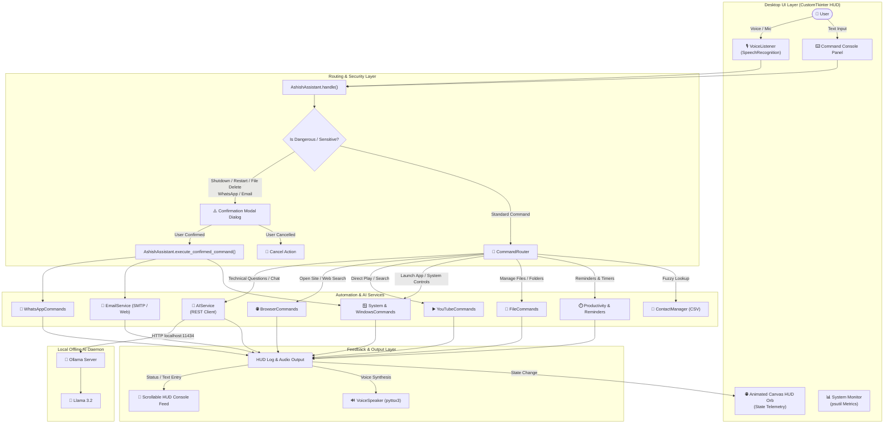

# 🤖 ASHISH AI — Personal Windows AI Voice Assistant

[](#system-requirements)
[](#prerequisites)
[](#local-ai-architecture)
[](#futuristic-dashboard)
[](#testing)
[](#license)

> A futuristic, privacy-first personal AI voice assistant and desktop automation console built for Windows. Powered completely by local AI through **Ollama** and **Llama 3.2**, requiring **zero cloud API keys**, featuring multi-modal speech/text control, interactive system monitoring, automated security confirmation flows, and deep OS integration.

---

## 📑 Table of Contents

- [Overview](#overview)
- [Key Architectural Highlights](#key-architectural-highlights)
- [Features](#features)
  - [Local AI & Intelligence](#1-local-ai--intelligence)
  - [Voice & Speech Processing](#2-voice--speech-processing)
  - [Futuristic HUD Dashboard](#3-futuristic-hud-dashboard)
  - [Windows Desktop Automation](#4-windows-desktop-automation)
  - [YouTube Control](#5-youtube-control)
  - [Web Navigation & Search](#6-web-navigation--search)
  - [Communication & Messaging](#7-communication--messaging)
  - [File & Directory Management](#8-file--directory-management)
  - [Productivity & Memory](#9-productivity--memory)
- [System Architecture](#system-architecture)
- [Project Structure](#project-structure)
- [Local AI Architecture](#local-ai-architecture)
- [Prerequisites](#prerequisites)
- [Installation Guide](#installation-guide)
- [Configuration](#configuration)
- [Verified Command Usage](#verified-command-usage)
- [Security & Confirmation Architecture](#security--confirmation-architecture)
- [Testing](#testing)
- [Troubleshooting](#troubleshooting)
- [Roadmap](#roadmap)
- [Author](#author)
- [License](#license)

---

## 📌 Overview

**ASHISH AI** is an intelligent desktop assistant engineered specifically for the Windows environment. Inspired by sci-fi AI interfaces (such as JARVIS), it bridges offline machine intelligence, system monitoring, and hardware/software automation into a unified desktop cockpit.

### Why ASHISH AI Was Built

1. **Complete Privacy & Zero Cost**: Modern cloud AI assistants require credit cards, token subscriptions, or paid API keys (such as OpenAI or Google Gemini). ASHISH AI communicates with local models hosted on your machine using **Ollama**, ensuring your conversations and personal data never leave your computer.
2. **True System Integration**: Unlike web-only chatbots, ASHISH AI interacts directly with the Windows operating system: controlling processes, managing files, launching software, adjusting volume, locking the workstation, and querying system metrics.
3. **Safety by Design**: Sensitive operations (shutting down, restarting, deleting files, sending WhatsApp messages, or dispatching emails) cannot execute blindly; they trigger specialized security modal dialogs with dual-action confirmation before any state change occurs.
4. **Futuristic Cockpit Experience**: Built with a reactive CustomTkinter dark-mode interface featuring a real-time rotating HUD Orb with state-dependent pulsating animations, live hardware telemetry (CPU, RAM, Battery, Network status), and a chronological command log feed.

---

## ⚡ Key Architectural Highlights

| Pillar | Implementation |
|---|---|
| **AI Brain** | Local Ollama REST engine running `llama3.2` on `localhost:11434` (zero external API keys) |
| **Speech-to-Text (STT)** | SpeechRecognition with dynamic ambient noise calibration |
| **Text-to-Speech (TTS)** | Native `pyttsx3` with automated Windows voice detection and rate/pitch configuration |
| **GUI Framework** | Multi-threaded `customtkinter` with custom Canvas HUD Orb animations |
| **System Telemetry** | Background hardware polling via `psutil` (CPU %, RAM %, Battery %, Time/Date) |
| **Safety Engine** | Modal confirmation intercepts for sensitive commands, WhatsApp, and emails |
| **Data Persistence** | SQLite databases for chat sessions (`ayra_chat.db`) and reminders (`ayra_memory.db`) |

---

## ✨ Features

### 1. Local AI & Intelligence
- **100% Offline Capable**: Connects directly to local Ollama instances at `http://localhost:11434`.
- **Dynamic Endpoint Probing**: Automatically discovers and tests candidate endpoints (`OLLAMA_URL`, `http://127.0.0.1:11434`, and `http://localhost:11434`).
- **Model Auto-Detection**: Queries `/api/tags` to locate installed models. If the configured `llama3.2` model tag differs or is missing, it dynamically falls back to the first available installed model.
- **REST Fallback Engine**: Uses Ollama's `/api/chat` endpoint and gracefully falls back to `/api/generate` if needed.
- **Technical Q&A**: Answers programming, scientific, and general questions directly within the application HUD without launching a web browser.

### 2. Voice & Speech Processing
- **Push-to-Talk & One-Shot Listening**: Dedicated microphone capture triggered via the console HUD or programmatic hooks.
- **Ambient Noise Adjustment**: Automatically samples background audio for 0.5s before listening to establish noise thresholds.
- **Customizable Speech Output**: Configurable voice ID, adjustable speech rate (words per minute), and volume sliders.
- **Wake Word Listener**: Background detection thread monitoring for wake phrases (e.g., `"hey Ashish"` / `"hey ayra"`).
- **Multi-Language Support**: Configured for English (`en-US`), Hindi (`hi-IN`), and Odia (`or-IN`).

### 3. Futuristic HUD Dashboard
- **Triple-Column Cockpit Layout**:
  - **Left Panel**: System Monitor displaying real-time CPU %, RAM %, Battery state, Network connectivity, Date, Time, and access to Settings.
  - **Center Panel**: Multi-ring glowing animated Canvas Orb featuring concentric rotating arcs and dynamic pulse behaviors mapped to operational states (`READY`, `LISTENING`, `PROCESSING`, `EXECUTING`, `SPEAKING`, `ERROR`).
  - **Right Panel**: Command Console with an active speech transcript box, 8 quick-command launch buttons, entry input field, and a chronological HUD event feed.
- **Dynamic Confirmation Modals**: Toplevel modal overlays requiring explicit user confirmation before sensitive actions execute.

### 4. Windows Desktop Automation
- **Application Launcher**: Native launch support for Windows apps:
  - Notepad, Calculator, Paint, File Explorer, Task Manager, Control Panel
  - Command Prompt, PowerShell, Windows Settings (`ms-settings:`)
  - VS Code, Google Chrome, Microsoft Edge, Mozilla Firefox, Brave, Spotify, VLC, Steam, Zoom, Microsoft Teams, Telegram, Discord, Word, Excel, PowerPoint
- **System Controls**:
  - Lock computer workstation (`ctypes.windll.user32.LockWorkStation`)
  - Restart Windows Explorer process (`explorer.exe`)
  - Volume control: Increase, Decrease, and Mute (via NirCmd integration)
  - Put computer to sleep (`rundll32.exe powrprof.dll,SetSuspendState`)
  - Workstation logout (`shutdown /l`)
  - Safe system shutdown and restart (intercepted by confirmation modal)
- **Live System Diagnostics**: Query CPU usage %, RAM usage %, battery health %, and network status via voice or text.

### 5. YouTube Control
- **Smart Query Parsing**: Distinguishes between browsing and playing media:
  - **Search Only**: `"Search YouTube for Python tutorials"` opens the exact YouTube search results page without autoplaying.
  - **Direct Play**: `"Play Believer"` extracts top matching video IDs via YouTube search scraping (`watch?v={id}`), opens the video page directly, and triggers playback using a scheduled keystroke handler (`k`) in a background thread.

### 6. Web Navigation & Search
- **Instant Website Shortcuts**: Opens pre-mapped services directly in the default browser:
  - Google, YouTube, Gmail, Google Drive, GitHub, Stack Overflow
  - LinkedIn, ChatGPT, Gemini, WhatsApp Web, Instagram, Facebook, X (Twitter), Flipkart
- **Web Search Integration**: Direct search routing for Google, GitHub, and Stack Overflow.
- **Live Weather**: Fetches real-time temperature and wind speeds using the Open-Meteo Geocoding and Forecast API.

### 7. Communication & Messaging
- **WhatsApp Web Integration**:
  - Natural language parsing: `"Send WhatsApp message to Maa saying I will be home soon"`.
  - Number normalization: Automatically formats 10-digit Indian telephone numbers with country code `+91`.
  - Intercepted by an interactive confirmation modal showing the target recipient, resolved phone number, and exact message payload before dispatching.
- **Email Service**:
  - Dual-mode architecture: Sends automated emails over Gmail SMTP SSL (`smtp.gmail.com:465`) if `.env` credentials exist, or opens a pre-composed web draft in Gmail.
  - Natural language parsing with subject and body extraction.
  - Intercepted by an interactive confirmation modal before sending.
- **Contact Manager**:
  - Reads stored contacts from `contacts.csv`.
  - **Ambiguity Detection**: If a contact query matches multiple entries (e.g. `"Rahul"` matching both `"Rahul Sharma"` and `"Rahul Verma"`), execution pauses and prompts the user for clarification.

### 8. File & Directory Management
- **Desktop-Aware File Operations**: Automatically targets the user's Desktop directory when simple file or folder names are provided.
- **Compound File Commands**: Supports compound instructions in a single sentence (e.g. `"Create folder Projects and create file main.py inside it"`).
- **Safe Directory Operations**: Supports folder creation, listing directory contents, moving, copying, and renaming files. Direct deletion of files or folders is blocked and redirected to confirmation safety.

### 9. Productivity & Memory
- **SQLite Reminders**: Add, list, complete, and delete time-stamped reminders stored locally in SQLite (`ayra_memory.db`).
- **Productivity Timers**: Built-in stopwatch, countdown timer thread, and Pomodoro timer helper.
- **Quick Notes**: Store rapid text notes into the local database memory.
- **Arithmetic Calculator**: Safe mathematical expression evaluation for instant voice or text calculations.

---

## 🏗️ System Architecture



---

## 📂 Project Structure

```text
ASHISH-AI/
├── ai/
│   ├── __init__.py
│   ├── ai_service.py           # Core local Ollama AI client (health check, probing, /api/chat)
│   ├── assistant.py            # Primary brain (intent parsing, safety checks, execution)
│   ├── gemini_client.py        # Backward-compatible wrapper routing to AIService
│   ├── memory.py               # In-memory conversation state buffer
│   ├── memory_manager.py       # User profile and memory persistence logic
│   ├── memory_prompt.py        # Memory context prompt builder
│   ├── openaiclient.py         # Disabled cloud client stub
│   └── prompts.py              # Prompt definitions placeholder
├── assets/                     # Visual assets and design references
├── commands/
│   ├── __init__.py
│   ├── browser.py              # Website shortcuts and web search handling
│   ├── calculator.py           # Arithmetic calculation evaluation
│   ├── clipboard.py            # Clipboard copy and paste controls
│   ├── contacts.py             # CSV contact loading with ambiguity resolution
│   ├── email_service.py        # Gmail SMTP and web compose email automation
│   ├── files.py                # File and folder operations (create, move, rename)
│   ├── news.py                 # News aggregator service helper
│   ├── productivity.py         # Stopwatch, countdown, and Pomodoro utilities
│   ├── reminders.py            # SQLite-backed reminder persistence
│   ├── router.py               # Deterministic keyword & regex intent router
│   ├── screenshot.py           # Screen capture automation
│   ├── system.py               # OS controls, hardware diagnostics, and apps
│   ├── weather.py              # Open-Meteo weather forecast client
│   ├── whatsapp.py             # WhatsApp Web and automated message dispatcher
│   ├── windows.py              # Windows process, explorer, and workstation controls
│   └── youtube.py              # Direct YouTube playback & search handlers
├── config/
│   ├── __init__.py
│   ├── personality.py          # Persona prompt and fallback responses
│   ├── settings.py             # Environment settings and directory bootstrap
│   └── voice_settings.json     # Persisted voice rate, volume, and wake word preferences
├── database/
│   ├── ayra_chat.db            # SQLite database for chat session records
│   ├── ayra_memory.db          # SQLite database for user memories and reminders
│   ├── chat_db.py              # SQLite chat persistence interface
│   ├── database.py             # Legacy database initialization helper
│   └── models.py               # Dataclass schemas (UserProfile, MemoryItem, Reminder)
├── logs/                       # Application runtime and automation log files
├── screenshots/                # Default directory for captured screenshots
├── tests/
│   ├── run_local_checks.py     # Local manual verification scratch script
│   ├── test_assistant_upgrade.py # 12 automated unit tests for core upgrade features
│   └── test_gemini_client.py   # 7 automated unit tests for local AI service & fallback
├── ui/
│   ├── __init__.py
│   ├── app.py                  # Main CustomTkinter shell, HUD Orb, and system monitor
│   ├── chat.py                 # Command Console, feed entries, and confirmation modal
│   └── setting.py              # Voice and speech settings dialog window
├── voice/
│   ├── __init__.py
│   ├── language.py             # Language normalization (English, Hindi, Odia)
│   ├── listener.py             # SpeechRecognition microphone listener
│   ├── speaker.py              # Pyttsx3 TTS voice synthesis engine
│   ├── voice_manager.py        # Central speech coordinator and thread manager
│   └── wakeword.py             # Background wake-word listening loop
├── .env.example                # Example environment variable template
├── .gitignore                  # Git untracked pattern definitions
├── contacts.csv                # Local contacts storage (name, number, email)
├── main.py                     # Desktop application entry point
├── requirements.txt            # Python package dependencies
└── README.md                   # Project documentation
```

---

## 🧠 Local AI Architecture

ASHISH AI does **not** rely on external paid APIs (such as OpenAI GPT-4 or Google Gemini). Instead, it runs fully private local models via **Ollama**.

```text
User Request: "What is polymorphism in C++?"
                    │
                    ▼
          AshishAssistant.handle()
                    │
                    ▼
          CommandRouter._is_ai_question()
                    │
                    ▼
          AIService.ask()
                    │
     Probe candidate endpoints:
     1. $OLLAMA_URL (from .env)
     2. http://127.0.0.1:11434
     3. http://localhost:11434
                    │
                    ▼
          GET /api/tags  ─── Check installed models & normalize tag
                    │
                    ▼
          POST /api/chat ─── {"model": "llama3.2", "messages": [...]}
                    │
         (Fallback to /api/generate if /api/chat is unsupported)
                    │
                    ▼
          Extract message content
                    │
                    ▼
          Return answer to HUD Console and Voice Speaker
```

### Why This Matters:
- **No Cloud API Keys Required**: You do not need a Google Cloud project or an OpenAI billing account.
- **Zero Data Leakage**: Sensitive queries never travel over third-party cloud servers.
- **Graceful Offline Degradation**: If Ollama is not running, the assistant does not crash. It cleanly responds:
  `"Local AI is offline. Please start Ollama."`

---

## 💻 Prerequisites

Ensure your system meets the following specifications before installing:

1. **Operating System**: Windows 10 or Windows 11 (64-bit).
2. **Python**: Python 3.10, 3.11, 3.12, or 3.13.
3. **Ollama**: Installed and running on your local machine. Download from [ollama.com](https://ollama.com/).
4. **Hardware**:
   - Minimum 8 GB RAM (16 GB recommended for smooth `llama3.2` inference).
   - Microphone and speakers/headphones for voice input and speech synthesis.

---

## 🚀 Installation Guide

Open **PowerShell** as an administrator or standard user and follow these steps:

### 1. Clone the Repository
```powershell
git clone https://github.com/ashishsahoo18/my-own-voice-assistant.git "C:\path\to\ASHISH-AI"
Set-Location "C:\path\to\ASHISH-AI"
```

### 2. Create and Activate a Virtual Environment
```powershell
python -m venv venv
.\venv\Scripts\Activate.ps1
```

### 3. Install Python Dependencies
```powershell
python -m pip install --upgrade pip
pip install -r requirements.txt
```

> **Note on PyAudio**: `requirements.txt` installs `pyaudio>=0.2.14` automatically on Windows. If your environment lacks the MSVC build tools for PyAudio, install a precompiled wheel using `pip install pipwin; pipwin install pyaudio`.

### 4. Install and Start Ollama
1. Download and install Ollama from [ollama.com/download](https://ollama.com/download).
2. Open PowerShell and pull the **Llama 3.2** model:
   ```powershell
   ollama pull llama3.2
   ```
3. Verify that the Ollama service is active:
   ```powershell
   curl http://localhost:11434/api/tags
   ```

### 5. Configure Environment Variables
Copy `.env.example` to create your local `.env` file:
```powershell
Copy-Item .env.example .env
```

### 6. Run the Application
Launch ASHISH AI using Python:
```powershell
python main.py
```

---

## ⚙️ Configuration

Application settings are managed via `.env` and `config/voice_settings.json`.

### Environment Variables (`.env`)

```ini
# Local Ollama AI Settings (No cloud API key required)
OLLAMA_URL=http://localhost:11434
OLLAMA_MODEL=llama3.2
OLLAMA_TIMEOUT=120

# Gmail SMTP Settings (Optional - used for automated background email sending)
GMAIL_SENDER_EMAIL=your_email@gmail.com
GMAIL_APP_PASSWORD=your_16_character_app_password
```

> ⚠️ **Security Warning**: Never commit your `.env` file or your Gmail App Passwords to version control. The repository's `.gitignore` excludes `.env` by default.

### Voice & Wake Word Settings (`config/voice_settings.json`)

Persisted preferences for the speech system:

```json
{
  "voice_enabled": true,
  "auto_speaking": true,
  "auto_send_voice": false,
  "voice_id": "",
  "speech_rate": 148,
  "volume": 1.0,
  "language": "en",
  "wake_word": "hey Ashish",
  "wake_word_enabled": true,
  "push_to_talk_enabled": true
}
```

### Contact Book (`contacts.csv`)

Store recipient addresses for WhatsApp and Email automation:

```csv
name,number,email
Maa,+9163718832937,maa@gmail.com
Deba,+919827869683,deba@gmail.com
Rahul Sharma,+919876543210,rahul.sharma@gmail.com
Rahul Verma,+919876543211,rahul.verma@gmail.com
```

---

## 🗣️ Verified Command Usage

Every command below is implemented and verified directly in the codebase:

### 🧠 Local AI & Knowledge
| Command | What ASHISH AI Does |
|---|---|
| `"What is polymorphism in C++?"` | Queries local Llama 3.2 via Ollama and presents the explanation in the console & voice. |
| `"Explain binary search trees"` | Synthesizes a structured answer locally without opening a web browser. |
| `"Difference between TCP and UDP"` | Generates a concise technical comparison. |

### ▶️ YouTube Automation
| Command | What ASHISH AI Does |
|---|---|
| `"Play Believer"` | Resolves top video ID, launches the video directly on YouTube, and triggers playback. |
| `"Play Ik Mulaqaat"` | Opens the specific video watch URL directly. |
| `"Search YouTube for Python tutorials"` | Opens the YouTube search results page for `"Python tutorials"` without starting playback. |

### 🪟 Windows Applications & OS Controls
| Command | What ASHISH AI Does |
|---|---|
| `"Open Notepad"` | Launches `notepad.exe`. |
| `"Open Calculator"` | Launches `calc.exe`. |
| `"Open VS Code"` | Launches Visual Studio Code (`code`). |
| `"Open File Explorer"` | Opens Windows Explorer (`explorer.exe`). |
| `"Open Task Manager"` | Launches `taskmgr.exe`. |
| `"Open Settings"` | Opens Windows Settings (`ms-settings:`). |
| `"Lock computer"` | Instantly locks the workstation via Windows API. |
| `"Restart Explorer"` | Terminates and restarts `explorer.exe` to refresh the desktop shell. |
| `"Take a screenshot"` | Captures screen via PyAutoGUI and saves to `screenshots/screenshot.png`. |
| `"What is the current time?"` | Announces and prints the current system time. |
| `"What is today's date?"` | Announces and prints today's calendar date. |
| `"What is system status?"` | Queries CPU %, RAM %, and Battery %. |

### 🌐 Web & Search Shortcuts
| Command | What ASHISH AI Does |
|---|---|
| `"Open Google"` | Opens `https://www.google.com`. |
| `"Open GitHub"` | Opens `https://github.com`. |
| `"Open LinkedIn"` | Opens `https://www.linkedin.com`. |
| `"Open Flipkart"` | Opens `https://www.flipkart.com`. |
| `"Search Google for quantum computing"` | Executes an encoded Google search. |
| `"Search GitHub for fastAPI"` | Executes a search on GitHub. |
| `"Search Stack Overflow for recursion error"` | Opens matching discussions on Stack Overflow. |
| `"Weather in Delhi"` | Fetches live weather conditions via Open-Meteo. |

### 💬 Communication & Contacts
| Command | What ASHISH AI Does |
|---|---|
| `"Send WhatsApp message to Maa saying I am coming home"` | Resolves Maa's phone number and presents a confirmation modal before sending. |
| `"Send an email to Maa saying meeting update"` | Resolves email address and presents a confirmation modal before dispatching. |
| `"Send WhatsApp message to Rahul saying hello"` | Detects multiple contacts named Rahul and asks for clarification. |

### 📁 Files & Productivity
| Command | What ASHISH AI Does |
|---|---|
| `"Create a folder named Project on my Desktop"` | Creates `C:\Users\<User>\Desktop\Project`. |
| `"Create a file named script.py inside Project"` | Creates `C:\Users\<User>\Desktop\script.py`. |
| `"Remind me to call Deba at 5 PM"` | Saves a reminder into SQLite `ayra_memory.db`. |
| `"Show reminders"` | Lists all pending reminders. |
| `"Calculate 45 * 12 + 180"` | Evaluates arithmetic expression and returns `720`. |

---

## 🛡️ Security & Confirmation Architecture

To protect user safety and prevent unintended actions, ASHISH AI incorporates an explicit confirmation layer:

```text
                        User Command
                             │
                             ▼
              AshishAssistant.determine_intent()
                             │
            ┌────────────────┴────────────────┐
            ▼                                 ▼
    [Dangerous Command]              [Communication]
   (Shutdown / Restart /           (WhatsApp / Email)
    File Deletion)                            │
            │                                 │
            └────────────────┬────────────────┘
                             │
                             ▼
                Triggers ConfirmationModal
             ┌───────────────────────────────┐
             │  ⚠️ SYSTEM SECURITY CHECK     │
             │                               │
             │  Action: Send WhatsApp to Maa │
             │  Phone:  +9163718832937       │
             │  Msg:    "I am coming home"   │
             │                               │
             │      [CANCEL]    [CONFIRM]    │
             └───────────────────────────────┘
```

1. **Dangerous System Commands**: Requests containing `shutdown`, `restart`, or `delete file` are halted immediately. The assistant prompts both verbally and visually with a red-accented confirmation dialog.
2. **WhatsApp Protection**: Displays the resolved recipient name, telephone number, and message text. The message is dispatched only after the user clicks **SEND**.
3. **Email Verification**: Displays the recipient, destination email address, subject line, and body.
4. **Contact Disambiguation**: Prevents sending messages to the wrong person if multiple contacts share the same first name.

---

## 🧪 Testing

The repository includes comprehensive automated unit tests covering core assistant functionality, intent routing, local AI integration, and contact resolution.

### Running the Test Suite

Run tests from the project root using PowerShell:

```powershell
$env:PYTHONPATH="."
python -m unittest discover tests
```

To run individual test suites:

```powershell
# Core upgrade scenarios test suite
python tests/test_assistant_upgrade.py

# Local AI health check and model auto-detection suite
python tests/test_gemini_client.py
```

### Verified Test Results

```text
----------------------------------------------------------------------
tests/test_assistant_upgrade.py:
- test_01_open_google                             ... OK
- test_02_open_youtube                            ... OK
- test_03_search_youtube_for_python_tutorials     ... OK
- test_04_youtube_play_direct                     ... OK
- test_05_social_account_shortcuts                ... OK
- test_06_whatsapp_confirmation_preparation       ... OK
- test_07_email_confirmation_preparation          ... OK
- test_08_contact_ambiguity_detection             ... OK
- test_09_local_ai_question_answering             ... OK
- test_10_local_ai_offline_fallback               ... OK
- test_11_open_notepad                            ... OK
- test_12_current_time                            ... OK

tests/test_gemini_client.py:
- test_ai_service_offline_notice                  ... OK
- test_ai_service_no_models_installed             ... OK
- test_ai_service_online_response                 ... OK
- test_model_auto_detection                       ... OK
- (timeout & candidate endpoint probes)           ... OK

----------------------------------------------------------------------
Ran 19 tests in 0.157s

OK (19 passed, 0 failed, 0 errors)
```

---

## 🔧 Troubleshooting

### 1. "Local AI is offline. Please start Ollama."
- **Cause**: The Ollama background service is not running or is blocked.
- **Solution**:
  1. Open a new terminal and run `ollama serve`.
  2. Confirm access by navigating to `http://localhost:11434` in your browser.

### 2. "No local AI model is installed."
- **Cause**: Ollama is active, but no models have been pulled yet.
- **Solution**:
  ```powershell
  ollama pull llama3.2
  ```

### 3. "Local AI is taking longer than expected. Please try again."
- **Cause**: Generation timed out (default limit is 120 seconds) due to high CPU/GPU load.
- **Solution**: Increase `OLLAMA_TIMEOUT` in your `.env` file (e.g. `OLLAMA_TIMEOUT=180`) or use a lighter model.

### 4. Microphone Input Errors (`PyAudio` / `SpeechRecognition`)
- **Cause**: Missing microphone permissions or audio device driver conflict.
- **Solution**:
  1. Verify microphone access in **Windows Settings > Privacy & Security > Microphone**.
  2. If using Python on Windows, verify PyAudio installation:
     ```powershell
     pip install pyaudio
     ```

### 5. Volume Up / Down / Mute Does Not Work
- **Cause**: Windows system volume control utilizes NirCmd.
- **Solution**: Download `nircmd.exe` from NirSoft and place it in your Windows directory (`C:\Windows\System32\nircmd.exe`) or in your system `PATH`.

---

## 🗺️ Roadmap

### ✅ Implemented
- [x] Local AI integration with Ollama (`llama3.2`) at `localhost:11434`.
- [x] Zero cloud API key requirements for general knowledge and chat.
- [x] Automatic candidate endpoint probing and model auto-detection.
- [x] CustomTkinter futuristic 3-column cockpit with Canvas HUD Orb animation.
- [x] Live hardware telemetry (CPU, RAM, Battery, Network, Clock) via `psutil`.
- [x] Speech recognition with ambient noise adjustment and wake-word listener.
- [x] Native Windows speech synthesis (pyttsx3) with voice settings dialog.
- [x] Dedicated YouTube search vs. direct video playback with keystroke autoplay.
- [x] Windows application launcher and workstation security controls.
- [x] WhatsApp Web integration with 10-digit number sanitization.
- [x] Dual-mode email dispatch (Gmail SMTP SSL + Gmail web compose fallback).
- [x] Contact manager with CSV persistence and ambiguity resolution.
- [x] SQLite-backed reminders and conversation session logging.
- [x] Interactive security confirmation modals for sensitive operations.

### 🔮 Planned / Future
- [ ] Voice biometric speaker identification.
- [ ] Offline local speech recognition engine (e.g. `faster-whisper` integration).
- [ ] Fully local text-to-speech engine (e.g. Piper TTS).
- [ ] Multi-turn conversation reasoning with local tool-calling capabilities.
- [ ] Multi-monitor and virtual desktop management commands.

---

## 👨‍💻 Author

**Ashish Sahoo**
- **GitHub**: [@ashishsahoo18](https://github.com/ashishsahoo18)
- **Project**: ASHISH AI — Personal Windows Voice Assistant

---

## 📄 License

No license has currently been declared for this repository. All rights are reserved by the author. If you plan to distribute, reuse, or contribute code, please contact the author.

---

## 🌟 Support & Feedback

If you find **ASHISH AI** helpful or inspiring, consider giving this repository a star on GitHub! Suggestions and feedback are always welcome via issues or pull requests.